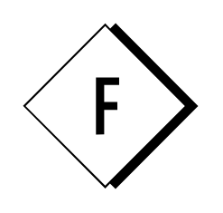

# Fashiolista

## Definition

```
{
  _style: 'dashed=0;outlineConnect=0;html=1;align=center;labelPosition=center;verticalLabelPosition=bottom;verticalAlign=top;shape=mxgraph.weblogos.fashiolista',
  _width: 77.60000000000001,
  _height: 73.2,
}
```

## Usage

```
import { Fashiolista } from '@reactiac/standard-components-diagrams/webLogos'

<Fashiolista/>
```

## Preview


