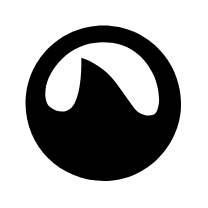

# Grooveshark

## Definition

```
{
  _style: { 
    entity: 'dashed=0;outlineConnect=0;html=1;align=center;labelPosition=center;verticalLabelPosition=bottom;verticalAlign=top;shape=mxgraph.weblogos.grooveshark;fillColor=#000000;strokeColor=none',
  },
  _original_width: 62.2,
  _original_height: 62.2,
}
```

## Usage

```
import { Grooveshark } from '@dinghy/standard-components-diagrams/webLogos'

<Grooveshark/>
```

## Preview


