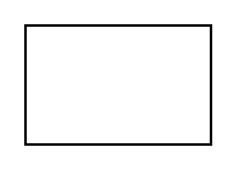

# Identi.ca

## Definition

```
{
  _style: 'dashed=0;outlineConnect=0;html=1;align=center;labelPosition=center;verticalLabelPosition=bottom;verticalAlign=top;shape=mxgraph.weblogos.identi.ca',
  _width: 74.2,
  _height: 47.6,
}
```

## Usage

```
import { IdentiCa } from '@diac/standard-components-diagrams/webLogos'

<IdentiCa/>
```

## Preview


