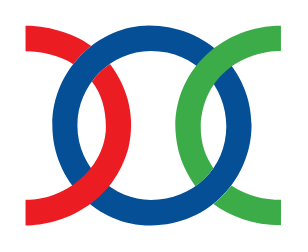

# Linkagogo

## Definition

```
{
  _style: 'dashed=0;outlineConnect=0;html=1;align=center;labelPosition=center;verticalLabelPosition=bottom;verticalAlign=top;shape=mxgraph.weblogos.linkagogo;fillColor=#F6F5FA;gradientColor=#C8C1E1',
  _width: 102.2,
  _height: 80,
}
```

## Usage

```
import { Linkagogo } from '@reactiac/standard-components-diagrams/webLogos'

<Linkagogo/>
```

## Preview


