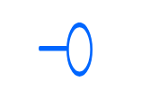

# Interface

## Definition

```
{
  _style: { 
    entity: 'image;aspect=fixed;perimeter=ellipsePerimeter;html=1;align=center;shadow=0;dashed=0;spacingTop=3;image=img/lib/active_directory/interface.svg;strokeColor=none;',
  },
  _original_width: 50,
  _original_height: 23.5,
}
```

## Usage

```
import { Interface } from '@dinghy/standard-components-diagrams/activeDirectory'

<Interface/>
```

## Preview


