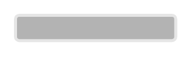

# Button (Pressed, Bright)

## Definition

```
{
  _style: 'rounded=1;html=1;shadow=0;dashed=0;whiteSpace=wrap;fontSize=10;fillColor=#B3B3B3;align=center;strokeColor=#E6E6E6;fontColor=#333333;strokeWidth=2;',
  _width: 105.5,
  _height: 16.88,
}
```

## Usage

```
import { ButtonPressedBright } from '@reactiac/standard-components-diagrams/android'

<ButtonPressedBright/>
```

## Preview


