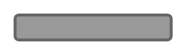

# Button (Pressed)

## Definition

```
{
  _style: { 
    entity: 'rounded=1;html=1;shadow=0;dashed=0;whiteSpace=wrap;fontSize=10;fillColor=#999999;align=center;strokeColor=#666666;fontColor=#ffffff;strokeWidth=2;',
  },
  _original_width: 105.5,
  _original_height: 16.88,
}
```

## Usage

```
import { ButtonPressed } from '@dinghy/standard-components-diagrams/android'

<ButtonPressed/>
```

## Preview


