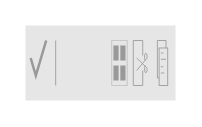

# Contextual Action Bar (Bright)

## Definition

```
{
  _style: 'strokeWidth=1;html=1;shadow=0;dashed=0;shape=mxgraph.android.contextual_action_bar_white;fillColor=#E6E6E6;',
  _width: 0,
  _height: 30,
}
```

## Usage

```
import { ContextualActionBarBright } from '@reactiac/standard-components-diagrams/android'

<ContextualActionBarBright/>
```

## Preview


