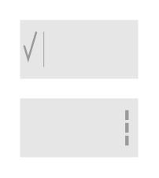

# Contextual Split Action Bar (Bright)

## Definition

```
{
  _style: { 
    entity: 'strokeWidth=1;html=1;shadow=0;dashed=0;shape=mxgraph.android.contextual_split_action_bar_white;fillColor=#E6E6E6;',
  },
  _original_width: 0,
  _original_height: 70,
}
```

## Usage

```
import { ContextualSplitActionBarBright } from '@diac/standard-components-diagrams/android'

<ContextualSplitActionBarBright/>
```

## Preview


