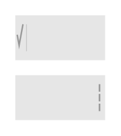

# Contextual Split Action Bar Landscape (Bright)

## Definition

```
{
  _style: 'strokeWidth=1;html=1;shadow=0;dashed=0;shape=mxgraph.android.contextual_split_action_bar_landscape_white;fillColor=#E6E6E6;',
  _width: 0,
  _height: 70,
}
```

## Usage

```
import { ContextualSplitActionBarLandscapeBright } from '@reactiac/standard-components-diagrams/android'

<ContextualSplitActionBarLandscapeBright/>
```

## Preview


