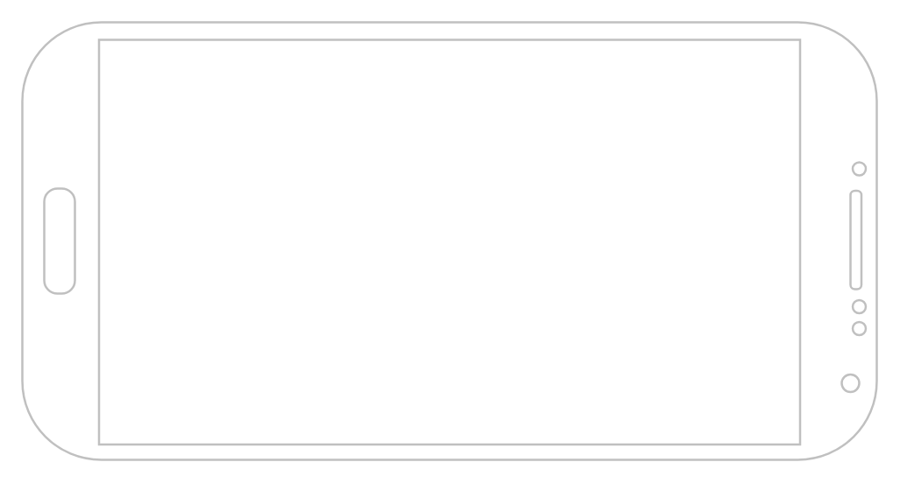

# Phone (landscape)

## Definition

```
{
  _style: { 
    entity: 'verticalLabelPosition=bottom;verticalAlign=top;html=1;shadow=0;dashed=0;strokeWidth=1;shape=mxgraph.android.phone2;strokeColor=#c0c0c0;direction=south;',
  },
  _original_width: 390,
  _original_height: 200,
}
```

## Usage

```
import { PhoneLandscape } from '@dinghy/standard-components-diagrams/android'

<PhoneLandscape/>
```

## Preview


