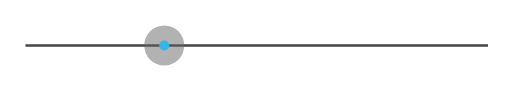

# Progress Scrubber Disabled

## Definition

```
{
  _style: { 
    entity: 'verticalLabelPosition=bottom;verticalAlign=top;html=1;shadow=0;dashed=0;strokeWidth=1;shape=mxgraph.android.progressScrubberDisabled;dx=0.3;fillColor=#33b5e5;',
  },
  _width: 185,
  _height: 16,
}
```

## Usage

```
import { ProgressScrubberDisabled } from '@diac/standard-components-diagrams/android'

<ProgressScrubberDisabled/>
```

## Preview


