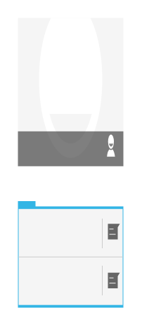

# Quick Contact

## Definition

```
{
  _style: { 
    entity: 'strokeWidth=1;html=1;shadow=0;dashed=0;shape=mxgraph.android.quick_contact;sketch=0;',
  },
  _original_width: 0,
  _original_height: 165,
}
```

## Usage

```
import { QuickContact } from '@diac/standard-components-diagrams/android'

<QuickContact/>
```

## Preview


