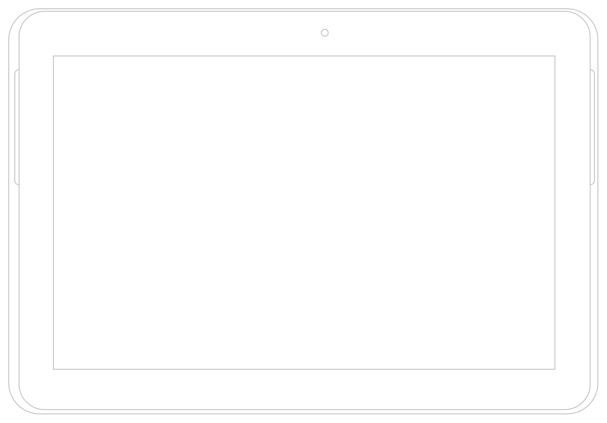

# Tab (landscape)

## Definition

```
{
  _style: { 
    entity: 'verticalLabelPosition=bottom;verticalAlign=top;html=1;shadow=0;dashed=0;strokeWidth=1;shape=mxgraph.android.tab2;strokeColor=#c0c0c0;direction=north;',
  },
  _width: 686,
  _height: 472,
}
```

## Usage

```
import { TabLandscape } from '@diac/standard-components-diagrams/android'

<TabLandscape/>
```

## Preview


