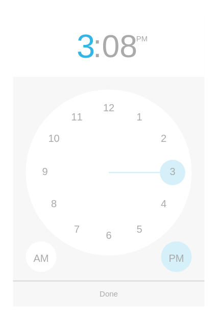

# Time Picker (Bright)

## Definition

```
{
  _style: { 
    entity: 'verticalLabelPosition=bottom;verticalAlign=top;html=1;shadow=0;dashed=0;strokeWidth=1;shape=mxgraph.android.time_picker;sketch=0;',
  },
  _original_width: 150,
  _original_height: 230,
}
```

## Usage

```
import { TimePickerBright } from '@dinghy/standard-components-diagrams/android'

<TimePickerBright/>
```

## Preview


