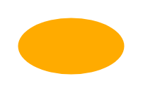

# Avatar (Away)

## Definition

```
{
  _style: { 
    entity: 'shape=ellipse;fillColor=#FFAB00;strokeColor=none;fontColor=#ffffff;align=center;verticalAlign=middle;whiteSpace=wrap;fontSize=17;fontStyle=1;html=1;sketch=0;',
  },
  _original_width: 0,
  _original_height: 32,
}
```

## Usage

```
import { AvatarAway } from '@dinghy/standard-components-diagrams/atlassian'

<AvatarAway/>
```

## Preview


