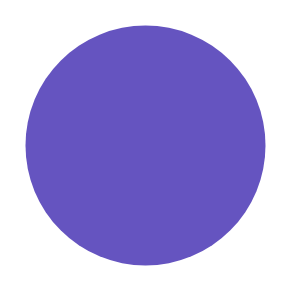

# Avatar (Large)

## Definition

```
{
  _style: 'shape=ellipse;fillColor=#6554C0;strokeColor=none;fontColor=#ffffff;align=center;verticalAlign=middle;whiteSpace=wrap;fontSize=46;fontStyle=1;html=1;sketch=0;',
  _width: 96,
  _height: 96,
}
```

## Usage

```
import { AvatarLarge } from '@reactiac/standard-components-diagrams/atlassian'

<AvatarLarge/>
```

## Preview


