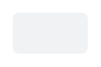

# Button (label only)

## Definition

```
{
  _style: 'rounded=1;align=center;fillColor=#F1F2F4;strokeColor=none;html=1;whiteSpace=wrap;fontColor=#596780;fontSize=12',
  _width: 0,
  _height: 33,
}
```

## Usage

```
import { ButtonLabelOnly } from '@diac/standard-components-diagrams/atlassian'

<ButtonLabelOnly/>
```

## Preview


