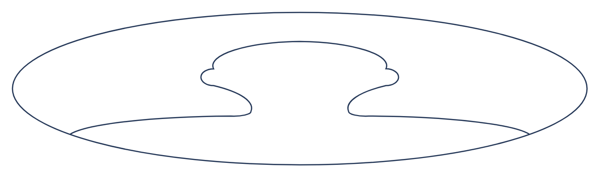

# Comment

## Definition

```
{
  _style: 'shape=mxgraph.ios7.icons.user;fillColor=#ffffff;strokeColor=#253858',
  _width: 470,
  _height: 125,
}
```

## Usage

```
import { Comment } from '@diac/standard-components-diagrams/atlassian'

<Comment/>
```

## Preview


