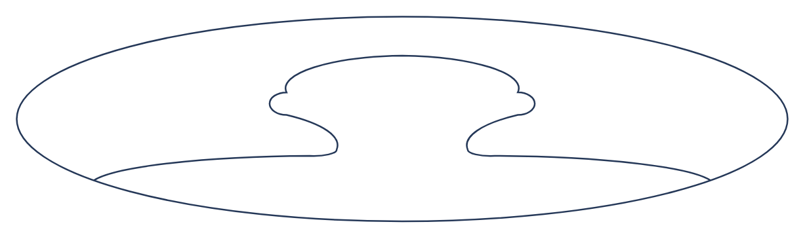

# Linear discussion

## Definition

```
{
  _style: 'shape=mxgraph.ios7.icons.user;fillColor=#ffffff;strokeColor=#253858;fontSize=12;align=left;fontColor=#000000;labelPosition=right;html=1;verticalAlign=top;spacingTop=-10;spacingLeft=5',
  _width: 470,
  _height: 125,
}
```

## Usage

```
import { LinearDiscussion } from '@reactiac/standard-components-diagrams/atlassian'

<LinearDiscussion/>
```

## Preview


