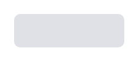

# Lozenge (state, bold)

## Definition

```
{
  _style: { 
    entity: 'dashed=0;html=1;rounded=1;fillColor=#DFE1E6;strokeColor=#DFE1E6;fontSize=12;align=center;fontStyle=1;strokeWidth=2;fontColor=#42526E',
  },
  _original_width: 70,
  _original_height: 20,
}
```

## Usage

```
import { LozengeStateBold } from '@dinghy/standard-components-diagrams/atlassian'

<LozengeStateBold/>
```

## Preview


