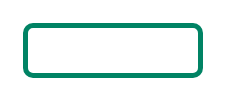

# Lozenge (success, subtle)

## Definition

```
{
  _style: 'dashed=0;html=1;rounded=1;strokeColor=#008364;fontSize=12;align=center;fontStyle=1;strokeWidth=2;fontColor=#008364',
  _width: 70,
  _height: 20,
}
```

## Usage

```
import { LozengeSuccessSubtle } from '@reactiac/standard-components-diagrams/atlassian'

<LozengeSuccessSubtle/>
```

## Preview


