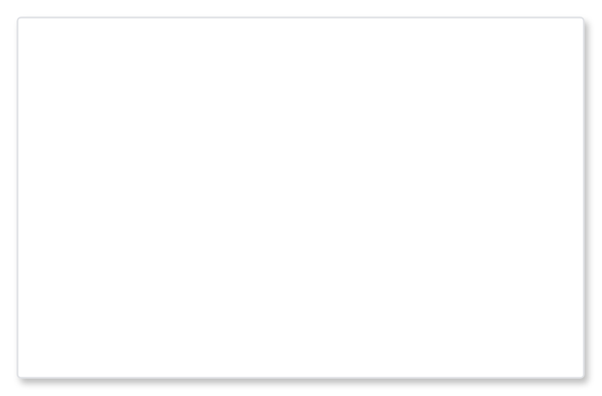

# Modal dialog (detailed)

## Definition

```
{
  _style: { 
    entity: 'html=1;rounded=1;fillColor=#ffffff;strokeColor=#DFE1E5;fontSize=12;align=left;fontColor=#000000;shadow=1;arcSize=1;whiteSpace=wrap;spacing=20;verticalAlign=top',
  },
  _original_width: 330,
  _original_height: 210,
}
```

## Usage

```
import { ModalDialogDetailed } from '@dinghy/standard-components-diagrams/atlassian'

<ModalDialogDetailed/>
```

## Preview


