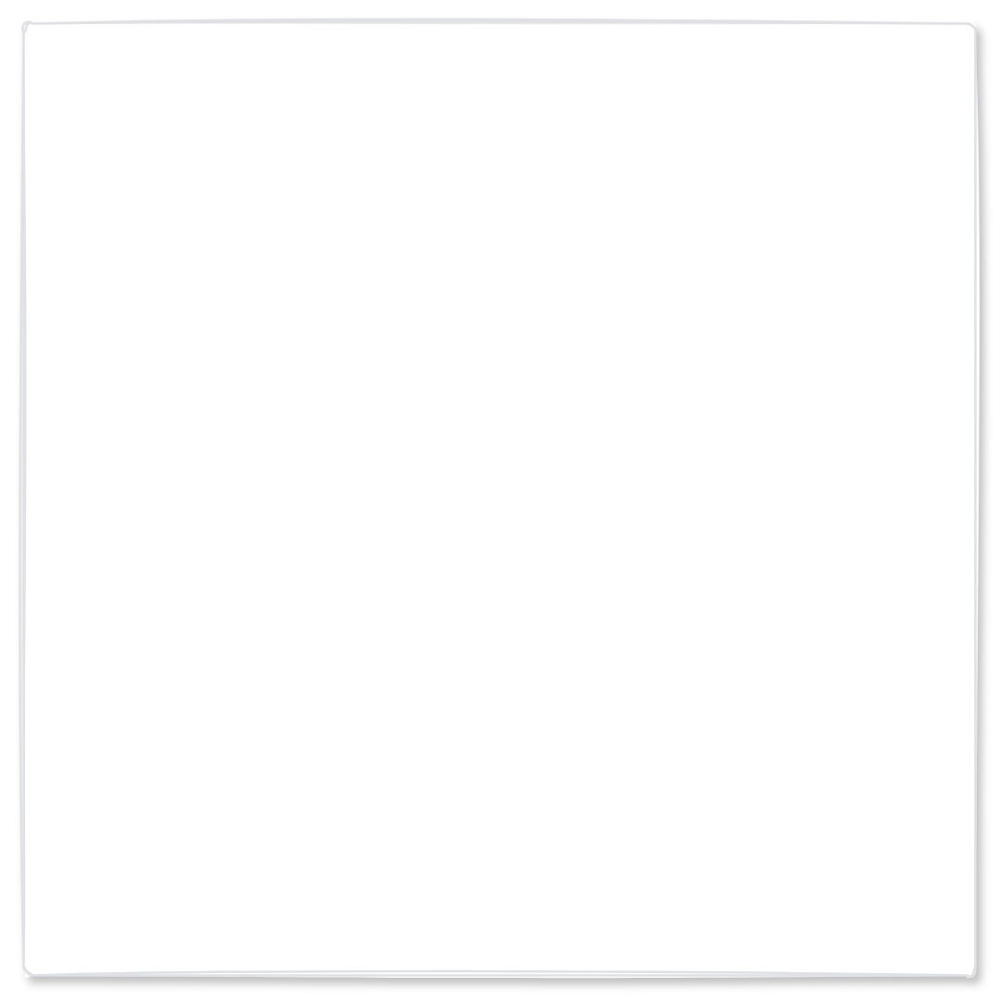

# Modal dialog (small)

## Definition

```
{
  _style: 'html=1;rounded=1;fillColor=#ffffff;strokeColor=#DFE1E5;fontSize=20;align=left;fontColor=#000000;shadow=1;arcSize=1;whiteSpace=wrap;spacing=20;verticalAlign=top;fontStyle=1;sketch=1;hachureGap=4;pointerEvents=0;fontFamily=Architects Daughter;fontSource=https%3A%2F%2Ffonts.googleapis.com%2Fcss%3Ffamily%3DArchitects%2BDaughter;',
  _width: 410,
  _height: 410,
}
```

## Usage

```
import { ModalDialogSmall } from '@reactiac/standard-components-diagrams/atlassian'

<ModalDialogSmall/>
```

## Preview


