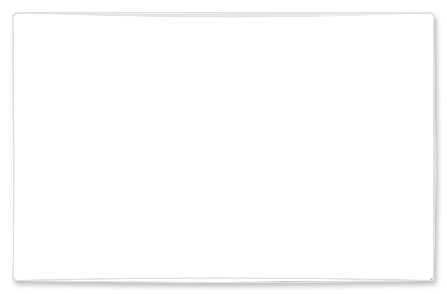

# Modal dialog

## Definition

```
{
  _style: 'html=1;rounded=1;fillColor=#ffffff;strokeColor=#DFE1E5;fontSize=12;align=left;fontColor=#000000;shadow=1;arcSize=1;whiteSpace=wrap;spacing=20;verticalAlign=top;sketch=1;hachureGap=4;pointerEvents=0;fontFamily=Architects Daughter;fontSource=https%3A%2F%2Ffonts.googleapis.com%2Fcss%3Ffamily%3DArchitects%2BDaughter;',
  _width: 330,
  _height: 210,
}
```

## Usage

```
import { ModalDialog } from '@diac/standard-components-diagrams/atlassian'

<ModalDialog/>
```

## Preview


