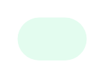

# Subtle Badge

## Definition

```
{
  _style: { 
    entity: 'rounded=1;fillColor=#E3FCEF;strokeColor=none;html=1;fontColor=#016745;align=center;verticalAlign=middle;whiteSpace=wrap;fontSize=18;fontStyle=0;arcSize=50;sketch=0;',
  },
  _width: 40,
  _height: 25,
}
```

## Usage

```
import { SubtleBadge } from '@diac/standard-components-diagrams/atlassian'

<SubtleBadge/>
```

## Preview


