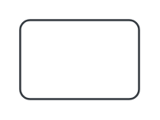

# Button, dark 2

## Definition

```
{
  _style: 'html=1;shadow=0;dashed=0;shape=mxgraph.bootstrap.rrect;rSize=5;strokeColor=#343A40;strokeWidth=1;fillColor=none;fontColor=#343A40;whiteSpace=wrap;align=center;verticalAlign=middle;spacingLeft=0;fontStyle=0;fontSize=16;spacing=5;',
  _width: 60,
  _height: 40,
}
```

## Usage

```
import { ButtonDark2 } from '@reactiac/standard-components-diagrams/bootstrap'

<ButtonDark2/>
```

## Preview


