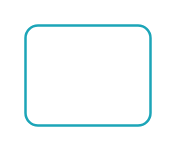

# Button, info 2

## Definition

```
{
  _style: 'html=1;shadow=0;dashed=0;shape=mxgraph.bootstrap.rrect;rSize=5;strokeColor=#1CA5B8;strokeWidth=1;fillColor=none;fontColor=#1CA5B8;whiteSpace=wrap;align=center;verticalAlign=middle;spacingLeft=0;fontStyle=0;fontSize=16;spacing=5;',
  _width: 50,
  _height: 40,
}
```

## Usage

```
import { ButtonInfo2 } from '@diac/standard-components-diagrams/bootstrap'

<ButtonInfo2/>
```

## Preview


