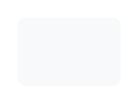

# Button, light

## Definition

```
{
  _style: { 
    entity: 'html=1;shadow=0;dashed=0;shape=mxgraph.bootstrap.rrect;rSize=5;strokeColor=none;strokeWidth=1;fillColor=#F8F9FA;fontColor=#000000;whiteSpace=wrap;align=center;verticalAlign=middle;spacingLeft=0;fontStyle=0;fontSize=16;spacing=5;',
  },
  _original_width: 60,
  _original_height: 40,
}
```

## Usage

```
import { ButtonLight } from '@diac/standard-components-diagrams/bootstrap'

<ButtonLight/>
```

## Preview


