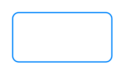

# Button, primary 2

## Definition

```
{
  _style: { 
    entity: 'html=1;shadow=0;dashed=0;shape=mxgraph.bootstrap.rrect;rSize=5;strokeColor=#0085FC;strokeWidth=1;fillColor=none;fontColor=#0085FC;whiteSpace=wrap;align=center;verticalAlign=middle;spacingLeft=0;fontStyle=0;fontSize=16;spacing=5;',
  },
  _original_width: 80,
  _original_height: 40,
}
```

## Usage

```
import { ButtonPrimary2 } from '@dinghy/standard-components-diagrams/bootstrap'

<ButtonPrimary2/>
```

## Preview


