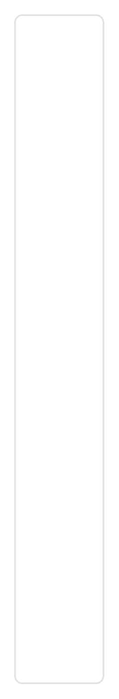

# Card 3

## Definition

```
{
  _style: { 
    entity: 'html=1;shadow=0;dashed=0;shape=mxgraph.bootstrap.rrect;rSize=5;strokeColor=#DFDFDF;html=1;whiteSpace=wrap;fillColor=#ffffff;fontColor=#000000;verticalAlign=bottom;align=left;spacing=20;spacingBottom=130;fontSize=14;',
  },
  _original_width: 0,
  _original_height: 450,
}
```

## Usage

```
import { Card3 } from '@dinghy/standard-components-diagrams/bootstrap'

<Card3/>
```

## Preview


