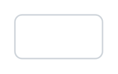

# File browser

## Definition

```
{
  _style: 'html=1;shadow=0;dashed=0;shape=mxgraph.bootstrap.rrect;rSize=5;strokeColor=#CED4DA;html=1;whiteSpace=wrap;fillColor=#FFFFFF;fontColor=#7D868C;align=left;spacingLeft=0;spacing=15;fontSize=14;',
  _width: 0,
  _height: 30,
}
```

## Usage

```
import { FileBrowser } from '@diac/standard-components-diagrams/bootstrap'

<FileBrowser/>
```

## Preview


