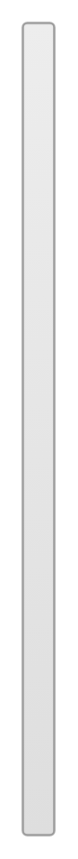

# Grid layout

## Definition

```
{
  _style: { 
    entity: 'html=1;shadow=0;dashed=0;shape=mxgraph.bootstrap.checkbox2;labelPosition=right;verticalLabelPosition=middle;align=left;verticalAlign=middle;gradientColor=#DEDEDE;fillColor=#EDEDED;checked=0;spacing=5;strokeColor=#999999;fontColor=#212529;checkedFill=#0085FC;checkedStroke=#ffffff;',
  },
  _original_width: 14,
  _original_height: 360,
}
```

## Usage

```
import { GridLayout } from '@dinghy/standard-components-diagrams/bootstrap'

<GridLayout/>
```

## Preview


