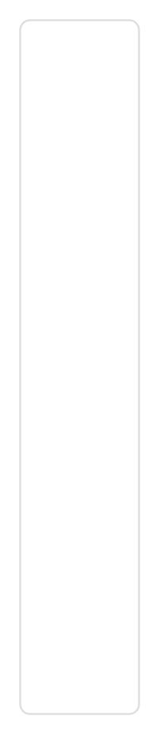
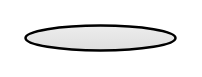
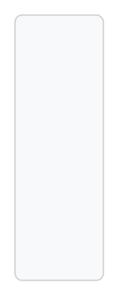
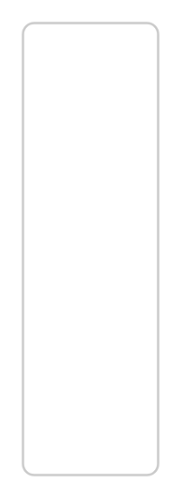
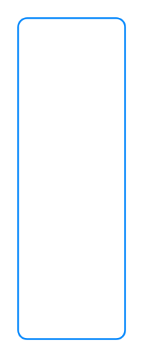
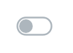
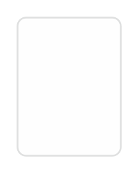
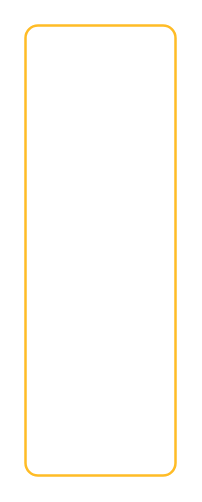

# Software Bootstrap Entities

- [Alert](./alert.md)  

- [Alert2](./alert-2.md)  

- [Alert3](./alert-3.md)  

- [Alert4](./alert-4.md)  

- [Alert5](./alert-5.md)  

- [Alert6](./alert-6.md)  

- [Alert7](./alert-7.md)  

- [Alert8](./alert-8.md)  

- [Alert9](./alert-9.md)  

- [Badge](./badge.md)  

- [Badge2](./badge-2.md)  

- [BadgeDanger](./badge-danger.md)  

- [BadgeDark](./badge-dark.md)  

- [BadgeInfo](./badge-info.md)  

- [BadgeLight](./badge-light.md)  

- [BadgePrimary](./badge-primary.md)  

- [BadgeSecondary](./badge-secondary.md)  

- [BadgeSuccess](./badge-success.md)  

- [BadgeWarning](./badge-warning.md)  

- [BasicInputGroup](./basic-input-group.md)  

- [BasicInputGroup2](./basic-input-group-2.md)  

- [BorderSpinner](./border-spinner.md)  

- [BorderSpinner2](./border-spinner-2.md)  

- [BorderSpinner3](./border-spinner-3.md)  

- [BorderSpinner4](./border-spinner-4.md)  

- [BorderSpinner5](./border-spinner-5.md)  

- [BorderSpinner6](./border-spinner-6.md)  

- [BorderSpinner7](./border-spinner-7.md)  

- [BorderSpinner8](./border-spinner-8.md)  

- [BreadcrumbOneLevel](./breadcrumb-one-level.md)  

- [ButtonGroupHorizontal](./button-group-horizontal.md)  

- [ButtonGroupVertical](./button-group-vertical.md)  

- [ButtonWithSpinner](./button-with-spinner.md)  

- [ButtonWithSpinner2](./button-with-spinner-2.md)  

- [ButtonDanger](./button-danger.md)  

- [ButtonDanger2](./button-danger-2.md)  

- [ButtonDark](./button-dark.md)  

- [ButtonDark2](./button-dark-2.md)  

- [ButtonInfo](./button-info.md)  

- [ButtonInfo2](./button-info-2.md)  

- [ButtonLight](./button-light.md)  

- [ButtonLight2](./button-light-2.md)  

- [ButtonLink](./button-link.md)  

- [ButtonPrimary](./button-primary.md)  

- [ButtonPrimary2](./button-primary-2.md)  

- [ButtonSecondary](./button-secondary.md)  

- [ButtonSecondary2](./button-secondary-2.md)  

- [ButtonSuccess](./button-success.md)  

- [ButtonSuccess2](./button-success-2.md)  

- [ButtonWarning](./button-warning.md)  

- [ButtonWarning2](./button-warning-2.md)  

- [Card](./card.md)  

- [Card2](./card-2.md)  

- [Card3](./card-3.md)  

- [Card4](./card-4.md)  

- [Card5](./card-5.md)  

- [CardGroup](./card-group.md)  

- [CardGroup2](./card-group-2.md)  

- [CardGroup3](./card-group-3.md)  

- [CardGroup4](./card-group-4.md)  

- [CardGroup5](./card-group-5.md)  

- [CardGroup6](./card-group-6.md)  

- [CardGroup7](./card-group-7.md)  

- [CardGroup8](./card-group-8.md)  

- [CardWithHeaderAndFooter](./card-with-header-and-footer.md)  

- [Carousel](./carousel.md)  

- [CheckboxWithoutLabel](./checkbox-without-label.md)  

- [CustomInputGroup](./custom-input-group.md)  

- [CustomInputGroup2](./custom-input-group-2.md)  

- [CustomInputGroup3](./custom-input-group-3.md)  

- [DangerCard](./danger-card.md)  

- [DangerCard2](./danger-card-2.md)  

- [DarkCard](./dark-card.md)  

- [DarkCard2](./dark-card-2.md)  

- [DefaultSizeDropdownButton](./default-size-dropdown-button.md)  

- [DropdownButton](./dropdown-button.md)  

- [DropdownButton2](./dropdown-button-2.md)  

- [DropdownButton4](./dropdown-button-4.md)  

- [DropdownButton5](./dropdown-button-5.md)  

- [DropdownButton7](./dropdown-button-7.md)  

- [DropdownButton8](./dropdown-button-8.md)  

- [DropdownButton9](./dropdown-button-9.md)  

- [DropdownWithRightAlignedMenu](./dropdown-with-right-aligned-menu.md)  

- [DropleftButton](./dropleft-button.md)  

- [FileBrowser](./file-browser.md)  

- [FileInputForm](./file-input-form.md)  

- [FileInputForm2](./file-input-form-2.md)  

- [Form](./form.md)  

- [Form2](./form-2.md)  

- [Form3](./form-3.md)  

- [Form4](./form-4.md)  

- [Form5](./form-5.md)  

- [FormGroups](./form-groups.md)  

- [GridLayout](./grid-layout.md)  

- [HelpText](./help-text.md)  

- [HelpText2](./help-text-2.md)  

- [HelpText3](./help-text-3.md)  

- [HelpText4](./help-text-4.md)  

- [HorizontalForm](./horizontal-form.md)  

- [HorizontalForm2](./horizontal-form-2.md)  

- [HorizontalForm3](./horizontal-form-3.md)  

- [HorizontalForm4](./horizontal-form-4.md)  

- [HorizontalForm5](./horizontal-form-5.md)  

- [HorizontalFormLabelSizing](./horizontal-form-label-sizing.md)  

- [HorizontalFormLabelSizing2](./horizontal-form-label-sizing-2.md)  

- [HorizontalFormLabelSizing3](./horizontal-form-label-sizing-3.md)  

- [HorizontalFormLabelSizing4](./horizontal-form-label-sizing-4.md)  

- [HorizontalNavigation](./horizontal-navigation.md)  

- [Image](./image.md)  

- [InfoCard](./info-card.md)  

- [InfoCard2](./info-card-2.md)  

- [InlineCheckboxes](./inline-checkboxes.md)  

- [InlineCheckboxes2](./inline-checkboxes-2.md)  

- [InlineForm](./inline-form.md)  

- [InlineForm2](./inline-form-2.md)  

- [InlineForm3](./inline-form-3.md)  

- [InlineForm4](./inline-form-4.md)  

- [InlineForm5](./inline-form-5.md)  

- [InlineRadioButtons](./inline-radio-buttons.md)  

- [InlineRadioButtons2](./inline-radio-buttons-2.md)  

- [Jumbotron](./jumbotron.md)  

- [LargeDropdownButton](./large-dropdown-button.md)  

- [LightCard](./light-card.md)  

- [LightCard2](./light-card-2.md)  

- [ListGroup](./list-group.md)  

- [ListGroup2](./list-group-2.md)  

- [ListGroupHorizontal](./list-group-horizontal.md)  

- [ListWithDivider](./list-with-divider.md)  

- [MediaObject](./media-object.md)  

- [MediaObject2](./media-object-2.md)  

- [ModalTitle](./modal-title.md)  

- [NavWithListGroup](./nav-with-list-group.md)  

- [Navbar](./navbar.md)  

- [NavbarBlue](./navbar-blue.md)  

- [NavbarDark](./navbar-dark.md)  

- [NavbarLight](./navbar-light.md)  

- [NavbarWithImage](./navbar-with-image.md)  

- [NavbarWithInlineElement](./navbar-with-inline-element.md)  

- [NavbarWithText](./navbar-with-text.md)  

- [NestedNav](./nested-nav.md)  

- [NestedNav2](./nested-nav-2.md)  

- [Pagination](./pagination.md)  

- [PillBadgeDanger](./pill-badge-danger.md)  

- [PillBadgeDark](./pill-badge-dark.md)  

- [PillBadgeInfo](./pill-badge-info.md)  

- [PillBadgeLight](./pill-badge-light.md)  

- [PillBadgePrimary](./pill-badge-primary.md)  

- [PillBadgeSecondary](./pill-badge-secondary.md)  

- [PillBadgeSuccess](./pill-badge-success.md)  

- [PillBadgeWarning](./pill-badge-warning.md)  

- [Popover](./popover.md)  

- [PopoverOnTop](./popover-on-top.md)  

- [PopoverOnTop2](./popover-on-top-2.md)  

- [PrimaryCard](./primary-card.md)  

- [PrimaryCard2](./primary-card-2.md)  

- [ProgressBar](./progress-bar.md)  

- [ProgressBarStripedBlue](./progress-bar-striped-blue.md)  

- [RangeInput](./range-input.md)  

- [RangeInput2](./range-input-2.md)  

- [ReadonlyInput](./readonly-input.md)  

- [ReadonlyPlainText](./readonly-plain-text.md)  

- [ReadonlyPlainText2](./readonly-plain-text-2.md)  

- [ReadonlyPlainText3](./readonly-plain-text-3.md)  

- [ReadonlyPlainText4](./readonly-plain-text-4.md)  

- [Scrollspy](./scrollspy.md)  

- [Scrollspy2](./scrollspy-2.md)  

- [SecondaryCard](./secondary-card.md)  

- [SecondaryCard2](./secondary-card-2.md)  

- [SmallDropdownButton](./small-dropdown-button.md)  

- [StackedCheckboxes](./stacked-checkboxes.md)  

- [StackedCheckboxes2](./stacked-checkboxes-2.md)  

- [StackedRadioButtons](./stacked-radio-buttons.md)  

- [StackedRadioButtons2](./stacked-radio-buttons-2.md)  

- [StackedRadioButtons3](./stacked-radio-buttons-3.md)  

- [SuccessCard](./success-card.md)  

- [SuccessCard2](./success-card-2.md)  

- [Switch](./switch.md)  

- [Switch2](./switch-2.md)  

- [Tabs](./tabs.md)  

- [Tabs2](./tabs-2.md)  

- [Tabs3](./tabs-3.md)  

- [Tabs4](./tabs-4.md)  

- [TabsWithDescription](./tabs-with-description.md)  

- [TabsWithDropdown](./tabs-with-dropdown.md)  

- [Text](./text.md)  

- [Toast](./toast.md)  

- [TooltipOnBottom](./tooltip-on-bottom.md)  

- [TooltipOnLeft](./tooltip-on-left.md)  

- [TooltipOnRight](./tooltip-on-right.md)  

- [TooltipOnTop](./tooltip-on-top.md)  

- [TooltipOnTop2](./tooltip-on-top-2.md)  

- [TooltipWithHtml](./tooltip-with-html.md)  

- [TwoCards](./two-cards.md)  

- [VerticalNavigation](./vertical-navigation.md)  

- [WarningCard](./warning-card.md)  

- [WarningCard2](./warning-card-2.md)  

