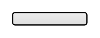

# Inline checkboxes

## Definition

```
{
  _style: 'html=1;shadow=0;dashed=0;shape=mxgraph.bootstrap.checkbox2;labelPosition=right;verticalLabelPosition=middle;align=left;verticalAlign=middle;gradientColor=#DEDEDE;fillColor=#EDEDED;checked=0;spacing=5;checkedFill=#0085FC;checkedStroke=#ffffff;',
  _width: 0,
  _height: 10,
}
```

## Usage

```
import { InlineCheckboxes } from '@diac/standard-components-diagrams/bootstrap'

<InlineCheckboxes/>
```

## Preview


