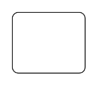

# Large dropdown button

## Definition

```
{
  _style: 'html=1;shadow=0;dashed=0;shape=mxgraph.bootstrap.rrect;rSize=5;strokeColor=#505050;strokeWidth=1;fillColor=#ffffff;fontColor=#777777;whiteSpace=wrap;align=left;verticalAlign=middle;fontStyle=0;fontSize=18;spacing=20;',
  _width: 0,
  _height: 50,
}
```

## Usage

```
import { LargeDropdownButton } from '@reactiac/standard-components-diagrams/bootstrap'

<LargeDropdownButton/>
```

## Preview


