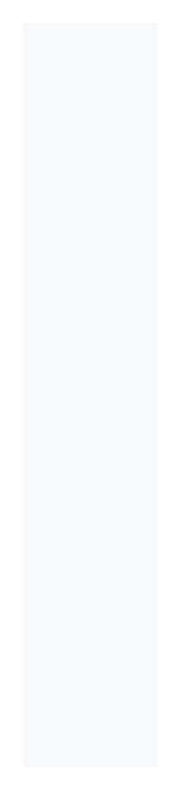

# Nested nav

## Definition

```
{
  _style: { 
    entity: 'fillColor=#F8F9FA;strokeColor=none;align=left;fontSize=14;fontColor=#323232;',
  },
  _original_width: 0,
  _original_height: 330,
}
```

## Usage

```
import { NestedNav } from '@dinghy/standard-components-diagrams/bootstrap'

<NestedNav/>
```

## Preview


