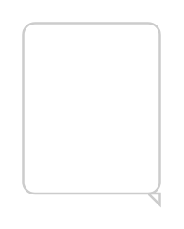

# Popover on top

## Definition

```
{
  _style: 'html=1;shadow=0;dashed=0;shape=mxgraph.bootstrap.popover;fillColor=#ffffff;strokeColor=#CCCCCC;dx=100;dy=5;rSize=5;whiteSpace=wrap;verticalAlign=top;spacing=10;fontSize=10;spacingLeft=0;align=left;spacingTop=-5;',
  _width: 0,
  _height: 80,
}
```

## Usage

```
import { PopoverOnTop } from '@reactiac/standard-components-diagrams/bootstrap'

<PopoverOnTop/>
```

## Preview


