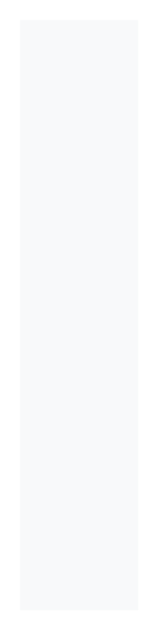

# Scrollspy

## Definition

```
{
  _style: { 
    entity: 'fillColor=#F8F9FA;strokeColor=none;align=left;fontSize=14;spacing=10;',
  },
  _original_width: 0,
  _original_height: 300,
}
```

## Usage

```
import { Scrollspy } from '@dinghy/standard-components-diagrams/bootstrap'

<Scrollspy/>
```

## Preview


