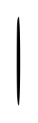

# Stacked radio buttons 2

## Definition

```
{
  _style: { 
    entity: 'html=1;shadow=0;dashed=0;shape=mxgraph.bootstrap.radioButton2;labelPosition=right;verticalLabelPosition=middle;align=left;verticalAlign=middle;gradientColor=#DEDEDE;fillColor=#EDEDED;checked=0;spacing=5;checkedFill=#0085FC;checkedStroke=#ffffff;sketch=0;',
  },
  _width: 1,
  _height: 50,
}
```

## Usage

```
import { StackedRadioButtons2 } from '@diac/standard-components-diagrams/bootstrap'

<StackedRadioButtons2/>
```

## Preview


