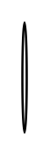

# Stacked radio buttons 3

## Definition

```
{
  _style: 'html=1;shadow=0;dashed=0;shape=mxgraph.bootstrap.radioButton2;labelPosition=right;verticalLabelPosition=middle;align=left;verticalAlign=middle;gradientColor=#DEDEDE;fillColor=#EDEDED;checked=0;spacing=5;fontColor=#6C767D;checkedFill=#0085FC;checkedStroke=#ffffff;sketch=0;',
  _width: 2,
  _height: 50,
}
```

## Usage

```
import { StackedRadioButtons3 } from '@reactiac/standard-components-diagrams/bootstrap'

<StackedRadioButtons3/>
```

## Preview


