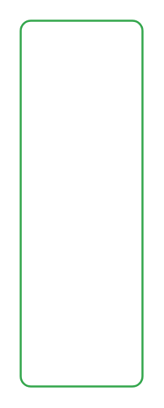

# Success card 2

## Definition

```
{
  _style: 'html=1;shadow=0;dashed=0;shape=mxgraph.bootstrap.rrect;rSize=5;strokeColor=#33A64C;html=1;whiteSpace=wrap;fillColor=#ffffff;fontColor=#33A64C;verticalAlign=bottom;align=left;spacing=20;spacingBottom=0;fontSize=14;',
  _width: 0,
  _height: 180,
}
```

## Usage

```
import { SuccessCard2 } from '@diac/standard-components-diagrams/bootstrap'

<SuccessCard2/>
```

## Preview


