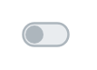

# Switch 2

## Definition

```
{
  _style: 'html=1;shadow=0;dashed=0;shape=mxgraph.bootstrap.switch;strokeColor=#ADB6BD;strokeWidth=1;fillColor=#E9ECEF;fontColor=#7D868C;onStrokeColor=#ffffff;onFillColor=#0085FC;align=left;verticalAlign=middle;spacingLeft=10;labelPosition=right;verticalLabelPosition=middle;buttonState=0;sketch=0;',
  _width: 20,
  _height: 10,
}
```

## Usage

```
import { Switch2 } from '@diac/standard-components-diagrams/bootstrap'

<Switch2/>
```

## Preview


