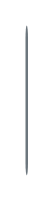

# Tooltip on top 2

## Definition

```
{
  _style: 'html=1;shadow=0;dashed=0;shape=mxgraph.bootstrap.rrect;rSize=5;fillColor=#6C767D;strokeColor=none;perimeter=none;whiteSpace=wrap;resizeWidth=1;align=center;spacing=5;fontColor=#FFFFFF;fontSize=14;',
  _width: 1,
  _height: 60,
}
```

## Usage

```
import { TooltipOnTop2 } from '@diac/standard-components-diagrams/bootstrap'

<TooltipOnTop2/>
```

## Preview


