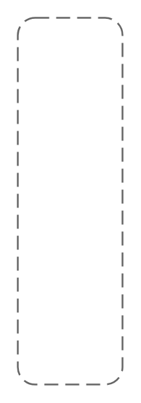

# Software C4 Entities

- [Component](./component.md)  

- [Container](./container.md)  

- [DataContainer](./data-container.md)  

- [ExternalPerson](./external-person.md)  

- [ExternalSoftwareSystem](./external-software-system.md)  

- [MessageBusContainer](./message-bus-container.md)  

- [MicroserviceContainer](./microservice-container.md)  

- [Person](./person.md)  

- [SoftwareSystem](./software-system.md)  

- [SystemContextDiagramTitle](./system-context-diagram-title.md)  

- [SystemScopeBoundary](./system-scope-boundary.md)  

- [WebBrowserContainer](./web-browser-container.md)  

