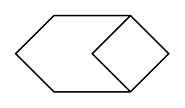

# Check 2

## Definition

```
{
  _style: { 
    entity: 'html=1;dashed=0;whiteSpace=wrap;shape=mxgraph.dfd.check2',
  },
  _original_width: 100,
  _original_height: 50,
}
```

## Usage

```
import { Check2 } from '@diac/standard-components-diagrams/dataFlowDiagram'

<Check2/>
```

## Preview


