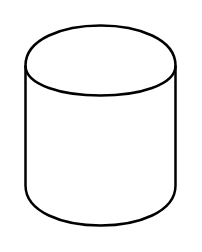

# Data Store 3

## Definition

```
{
  _style: 'shape=cylinder;whiteSpace=wrap;html=1;boundedLbl=1;backgroundOutline=1;',
  _width: 60,
  _height: 80,
}
```

## Usage

```
import { DataStore3 } from '@reactiac/standard-components-diagrams/dataFlowDiagram'

<DataStore3/>
```

## Preview


