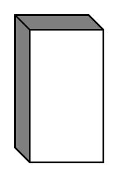

# External Entity

## Definition

```
{
  _style: { 
    entity: 'html=1;dashed=0;whiteSpace=wrap;shape=mxgraph.dfd.externalEntity',
  },
  _original_width: 0,
  _original_height: 100,
}
```

## Usage

```
import { ExternalEntity } from '@dinghy/standard-components-diagrams/dataFlowDiagram'

<ExternalEntity/>
```

## Preview


