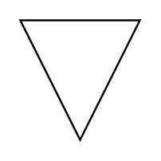

# Information/Data Carrier/SOP / Stop State

## Definition

```
{
  _style: 'triangle;whiteSpace=wrap;html=1;dashed=0;direction=south;',
  _width: 60,
  _height: 60,
}
```

## Usage

```
import { InformationDataCarrierSopStopState } from '@reactiac/standard-components-diagrams/dataFlowDiagram'

<InformationDataCarrierSopStopState/>
```

## Preview


