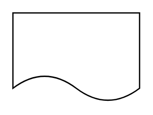

# Information / Data Carrier / SOP

## Definition

```
{
  _style: { 
    entity: 'shape=document;whiteSpace=wrap;html=1;boundedLbl=1;dashed=0;flipH=1;',
  },
  _original_width: 100,
  _original_height: 70,
}
```

## Usage

```
import { InformationDataCarrierSop } from '@diac/standard-components-diagrams/dataFlowDiagram'

<InformationDataCarrierSop/>
```

## Preview


